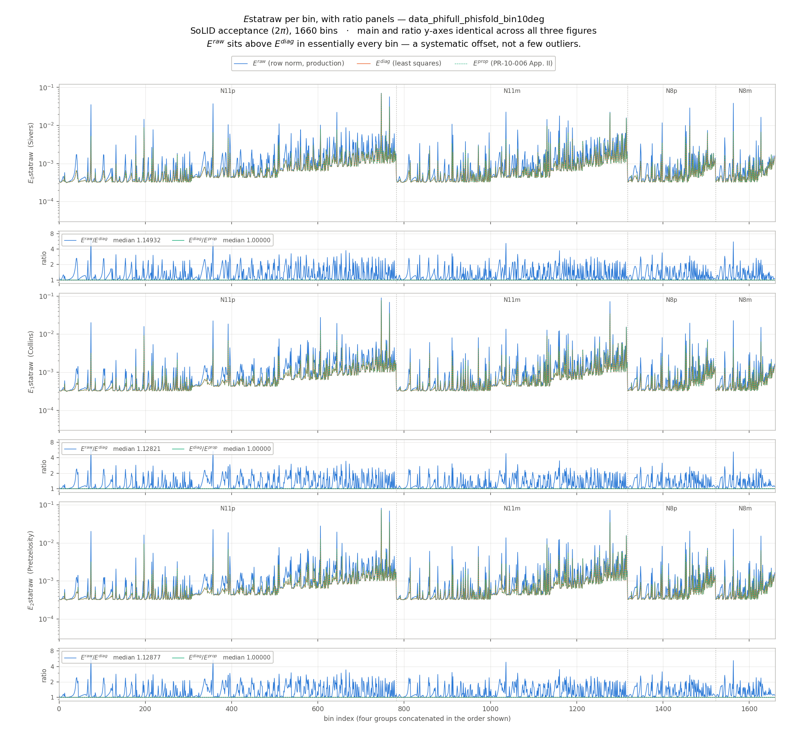
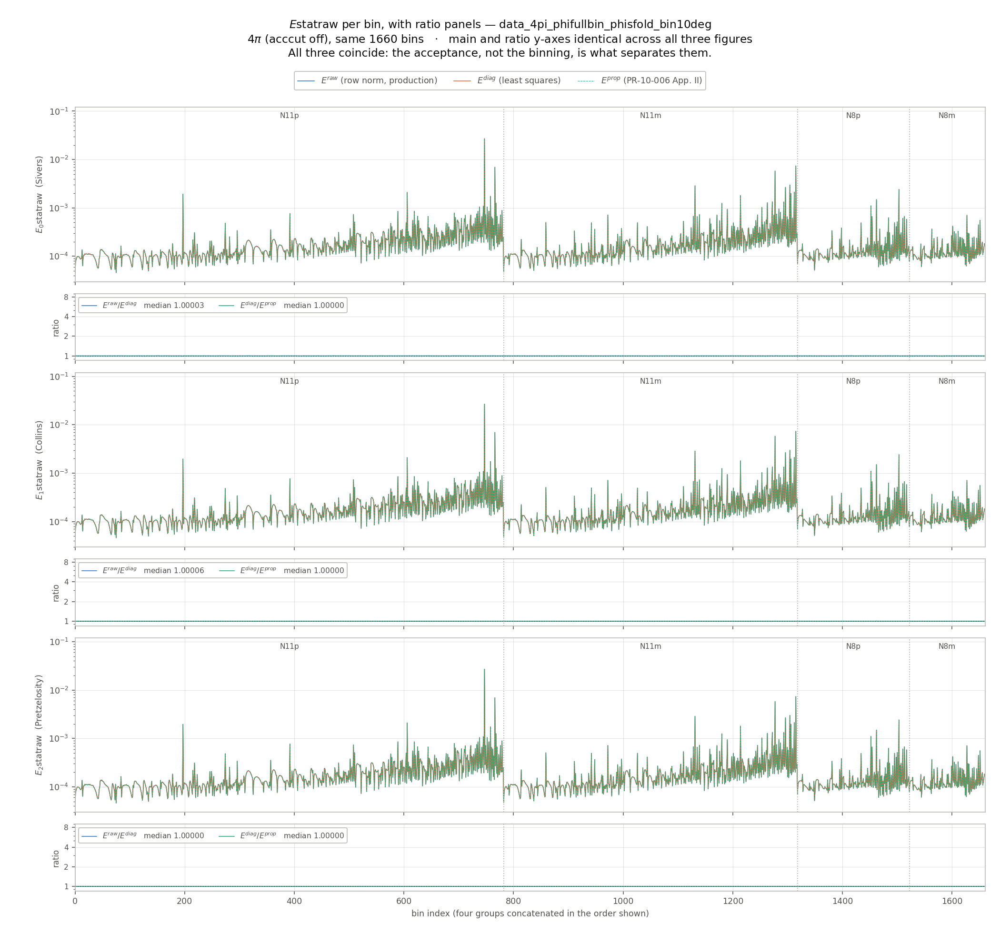
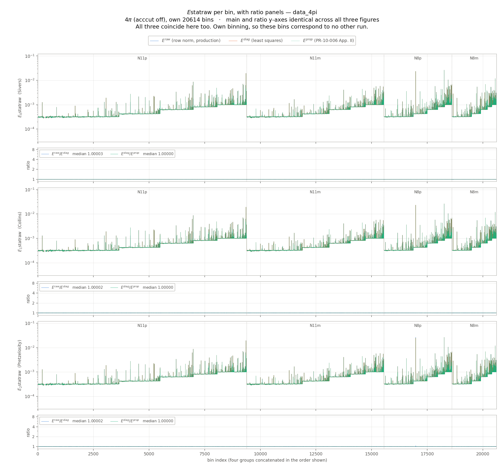
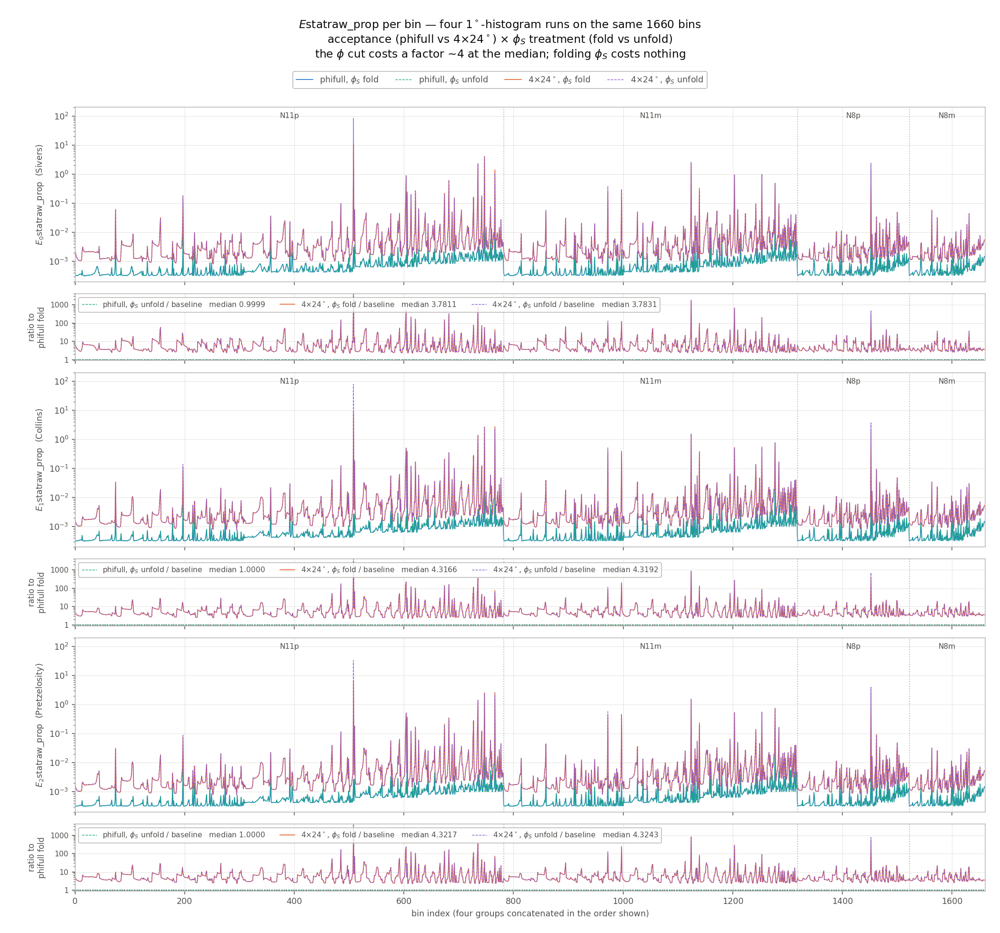
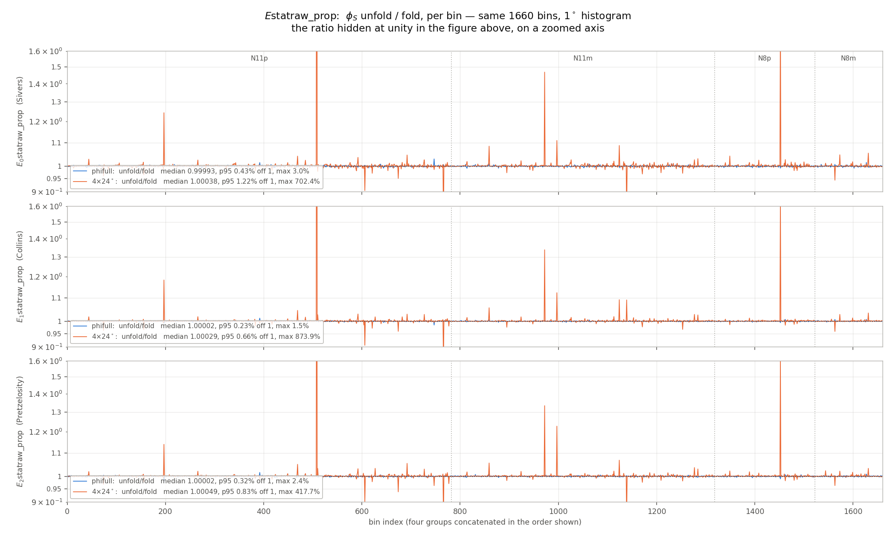

# Analytical Comparison of Appendix II and `MUT3`

## Initial question

> Understand pages 69–73, “Appendix II: Statistical Uncertainties Estimation,” in
> [PR-10-006-SoLID-Transversity.pdf](https://hallaweb.jlab.org/collab/PAC/PAC35/PR-10-006-SoLID-Transversity.pdf),
> and the code defining `MUT3` in
> [`SoLID_SIDIS_3He.h`](https://github.com/TianboLiu/LiuSIDIS/blob/master/SoLID/sidis2020/SoLID_SIDIS_3He.h).
>
> Then check analytically whether the two matrix definitions are the same and whether they would produce the same three variables with the same errors.

## Sources

- [SoLID Transversity proposal, Appendix II: Statistical Uncertainties Estimation, pp. 69–73](https://hallaweb.jlab.org/collab/PAC/PAC35/PR-10-006-SoLID-Transversity.pdf#page=69)
- [`SoLID_SIDIS_3He.h`, permanent GitHub revision](https://github.com/TianboLiu/LiuSIDIS/blob/41bf7928490a8b7506c0db3dbfc8d2112b17f055/SoLID/sidis2020/SoLID_SIDIS_3He.h#L740-L762)

## Conclusion

The two matrices are **not literally identical**, but they are equivalent representations of the same three-parameter fit when the projection vector is transformed consistently.

However, the statistical-error calculation in the code is equivalent to the appendix only for full, uniform angular coverage. For realistic incomplete or nonuniform acceptance, line 761 does not implement the covariance implied by the appendix and its least-\(\chi^2\) derivation.

| Question | Answer | Measured (Section 7) |
|---|---|---|
| Are the two matrices literally the same? | No | — |
| Are they equivalent through a change of projection basis? | Yes | agree to \(1.2\times10^{-14}\) |
| Would they give the same three amplitudes? | Yes, if the corresponding moment vectors are transformed consistently | — |
| Does the code give the same errors for full uniform coverage? | Yes | ratio \(1.00003\) at \(4\pi\) |
| Does it give the same errors for realistic/nonuniform coverage? | No; the error formula should use the diagonal of the inverse normal matrix | ratio \(1.135\) median, up to \(6.74\) |

**Every analytical claim below has since been checked numerically against the
generator itself.** See Section 7.

## 1. Three physical modulations

Define

$$
\phi=\phi_h-\phi_S
$$

and

$$
\mathbf f=
\begin{pmatrix}
f_a\\ f_b\\ f_c
\end{pmatrix}
=
\begin{pmatrix}
\sin\phi\\
\sin(2\phi_h-\phi)\\
\sin(2\phi_h+\phi)
\end{pmatrix}.
$$

The transverse target-spin asymmetry is

$$
A_{UT}=\mathbf f^T
\begin{pmatrix}a\\b\\c\end{pmatrix}.
$$

Equation 7 implies

$$
(a,b,c)=
(A_{\mathrm{Sivers}},A_{\mathrm{Collins}},A_{\mathrm{Pretzelosity}}).
$$

The sentence immediately following Equation 7 incorrectly swaps the descriptions of \(a\) and \(b\). The functional equation itself is unambiguous. The code therefore uses

$$
(E0,E1,E2)=(\mathrm{Sivers},\mathrm{Collins},\mathrm{Pretzelosity}).
$$

## 2. Matrix constructed by the code

Let angular bin \(k\) contain \(h_k\) expected events and define

$$
p_k=\frac{h_k}{N_{\rm acc}},
\qquad \sum_k p_k=1.
$$

The histogram covers

$$
\phi_h\in[-\pi,\pi],
\qquad |\phi_S|\in[0,\pi],
$$

so its total angular area is

$$
\Omega=(2\pi)(\pi)=2\pi^2.
$$

Lines 748–756 construct

$$
G\equiv {\tt MUT3}
=\Omega\sum_k p_k\,\mathbf f_k\mathbf f_k^T.
$$

Equivalently,

$$
G_{ij}=\int d\Omega\,g(\Omega)f_i(\Omega)f_j(\Omega),
$$

where \(g\) is the relative angular event distribution normalized to have average value one. Thus `MUT3` is the weighted Gram matrix, or normal matrix, of the three physical modulation functions. This is the matrix generated by the least-\(\chi^2\) equations in Section 16.3, particularly Equation 34.

## 3. Relation to the projection functions in Section 16.2

Section 16.2 also employs the projection vector

$$
\mathbf u=
\begin{pmatrix}
\sin\phi\\
\sin(2\phi_h)\cos\phi\\
\cos(2\phi_h)\sin\phi
\end{pmatrix}.
$$

The two bases are related by

$$
\mathbf f=T\mathbf u,
\qquad
T=
\begin{pmatrix}
1&0&0\\
0&1&-1\\
0&1&1
\end{pmatrix},
$$

and hence

$$
\mathbf u=S\mathbf f,
\qquad
S=T^{-1}=
\begin{pmatrix}
1&0&0\\
0&\tfrac12&\tfrac12\\
0&-\tfrac12&\tfrac12
\end{pmatrix}.
$$

If the appendix matrix is defined with \(\mathbf u\) as its row-projection basis and \(\mathbf f\) as its physical-modulation basis, then

$$
M_{\rm paper}
=\langle\mathbf u\mathbf f^T\rangle
=S\langle\mathbf f\mathbf f^T\rangle
=SG.
$$

Define the two corresponding data-moment vectors by

$$
\mathbf I_{\rm paper}=\langle\mathbf u A_{UT}\rangle,
\qquad
\mathbf J=\langle\mathbf f A_{UT}\rangle.
$$

They obey

$$
\mathbf I_{\rm paper}=S\mathbf J.
$$

Consequently,

$$
M_{\rm paper}^{-1}\mathbf I_{\rm paper}
=(SG)^{-1}S\mathbf J
=G^{-1}\mathbf J.
$$

Therefore the two formulations return exactly the same \((a,b,c)\) in exact arithmetic, provided each matrix is paired with its matching moment vector.

The current `AnalyzeEstatUT3` function does not actually form a data-moment vector or calculate \((a,b,c)\). It only constructs and inverts the normal matrix to forecast their statistical uncertainties.

### Typographical inconsistencies in Section 16.2

The appendix is internally inconsistent at several points:

1. The prose following Equation 7 swaps the Sivers and Collins labels of \(a\) and \(b\).
2. The sentence starting Section 16.2 says to project with the three physical functions \(\mathbf f\).
3. The displayed left sides of \(I_2\) and \(I_3\), Equations 19–21, and the Section 16.3 title instead use the components of \(\mathbf u\).
4. The displayed right side of \(I_3\) repeats \(\sin(2\phi_h-\phi)\), which cannot be correct for both \(I_2\) and \(I_3\).

These inconsistencies are typographical. Either a direct \(\mathbf f\) projection or the transformed \(\mathbf u\) projection gives the same fitted amplitudes when implemented consistently.

## 4. Statistical covariance

After

```cpp
MUT3.Invert();
```

the object `MUT3` contains \(G^{-1}\).

With the inverse-variance/event-density weighting derived in Section 16.3, and under the same small-asymmetry approximation used in the appendix, the raw covariance matrix is

$$
\boxed{
\operatorname{Cov}(\hat{\boldsymbol\theta})
=\frac{2\pi^2}{N_{\rm acc}}G^{-1}
},
\qquad
\hat{\boldsymbol\theta}=
\begin{pmatrix}\hat a\\\hat b\\\hat c\end{pmatrix}.
$$

Thus the three marginal uncertainties are

$$
\boxed{
\delta\theta_i
=\sqrt{\frac{2\pi^2}{N_{\rm acc}}(G^{-1})_{ii}}
}.
$$

This result is unchanged by the basis transformation above. In the paper basis, propagation gives

$$
M_{\rm paper}^{-1}
\operatorname{Cov}(\mathbf I_{\rm paper})
M_{\rm paper}^{-T},
$$

which reduces to the same covariance after using \(M_{\rm paper}=SG\) and transforming the moment covariance consistently.

## 5. What the code currently calculates

Line 761 evaluates

```cpp
Estatraw[i] = sqrt(
  2.0 * M_PI * M_PI / Nacc
  * (pow(MUT3(i,0),2)
     + pow(MUT3(i,1),2)
     + pow(MUT3(i,2),2))
  * M_PI * M_PI
);
```

Because `MUT3` has already been inverted, this is

$$
\delta\theta_{i,{\rm code}}^2
=\frac{2\pi^2}{N_{\rm acc}}\,
\pi^2\sum_j(G^{-1}_{ij})^2.
$$

The covariance derived from the normal equations instead requires

$$
\delta\theta_{i,{\rm correct}}^2
=\frac{2\pi^2}{N_{\rm acc}}(G^{-1})_{ii}.
$$

These expressions are not generally equal.

### Full and uniform coverage

For full uniform angular coverage, the three physical modulations are orthogonal:

$$
G=\pi^2 I,
\qquad
G^{-1}=\frac{1}{\pi^2}I.
$$

Both formulas then give

$$
\delta a=\delta b=\delta c=\sqrt{\frac{2}{N_{\rm acc}}},
$$

which agrees with Equation 15 of the appendix.

### Incomplete or nonuniform coverage

For realistic acceptance,

$$
G\ne\pi^2 I.
$$

The off-diagonal elements describe correlations among Sivers, Collins, and Pretzelosity, while the diagonal normalization also changes. The row-square expression on line 761 is then not the covariance obtained from the appendix's least-\(\chi^2\) derivation. In principle it can overestimate or underestimate the individual errors; **measured under the real SoLID acceptance it overestimates in 98.6% of cases** (Section 7), the remainder being round-off about the equality point.

## 6. Required code correction

With the present normalization of `MUT3`, replace the error calculation by

```cpp
MUT3.Invert();  // MUT3 now contains G^{-1}

for (int i = 0; i < 3; i++) {
  Estatraw[i] = sqrt(
    2.0 * M_PI * M_PI / Nacc * MUT3(i,i)
  );
}
```

The complete raw covariance, including correlations, is

```cpp
TMatrixD CovRaw = MUT3;
CovRaw *= 2.0 * M_PI * M_PI / Nacc;
```

The code subsequently calculates

```cpp
Estat[i] = Estatraw[i] / fn / 0.6 / 0.86;
```

These are additional dilution, polarization, or nuclear-extraction scale factors outside the matrix equivalence. Therefore only `Estatraw` should be directly compared with the raw statistical uncertainties derived in Appendix II. If a complete covariance is carried through these corrections, it must be divided by

$$
(f_n\times0.6\times0.86)^2.
$$

---

## 7. Numerical test against the generator (2026-08-27)

Everything above was derived on paper. It has now been checked by instrumenting
`AnalyzeEstatUT3` itself and running the generator in three acceptance
configurations.

### Method

Three estimators are computed per bin from the **same** `hs` histogram, so that
nothing but the error propagation differs. All are written to the tree; the
production `Estatraw` is untouched, so no existing result moves.

| branch | formula | this document |
|---|---|---|
| `E{0,1,2}statraw` | \(\sqrt{\tfrac{2\pi^2}{N_{\rm acc}}\pi^2\sum_j (G^{-1}_{ij})^2}\) | Section 5, the row norm |
| `E{0,1,2}statraw_diag` | \(\sqrt{\tfrac{2\pi^2}{N_{\rm acc}}(G^{-1})_{ii}}\) | Section 4, the boxed result |
| `E{0,1,2}statraw_prop` | \(\big[M_{\rm paper}^{-1}\langle\mathbf u\mathbf u^T\rangle M_{\rm paper}^{-T}\big]_{ii}\), scaled | Section 3, built in the **u** basis |

`_prop` is deliberately built by the *other* route — it forms the mixed matrix
\(M_{\rm paper}=\langle\mathbf u\mathbf f^T\rangle\), inverts that, and propagates
\(\delta_i^2=\int(\delta A)^2\big(\sum_j (M^{-1})_{ij}u_j\big)^2\) — so that
agreement with `_diag` is evidence rather than a shared code path.

Source: `SoLID_SIDIS_3He.h`, lines 917–940 (matrix and the three estimators).
An `[acccut]` argument was added to disable the detector entirely, giving the
Section-"full uniform coverage" limit as a runnable configuration rather than an
idealisation.

### Datasets

| run | acceptance | bins | amplitudes |
|---|---|---|---|
| `data_phifull_phisfold_bin10deg` | SoLID maps, full \(2\pi\) azimuth | 1660 | 4980 |
| `data_4pi_phifullbin_phisfold_bin10deg` | none (`acccut off`), same 1660 bins | 1660 | 4980 |
| `data_4pi_phisfold_bin10deg` | none (`acccut off`), own binning | 20614 | 61842 |

### Result 1 — the basis transformation cancels, as Section 3 claims

\(\max|E^{\rm prop}/E^{\rm diag}-1|\):

| run | value |
|---|---|
| `data_phifull_phisfold_bin10deg` | \(1.2\times10^{-14}\) |
| `data_4pi_phifullbin_phisfold_bin10deg` | \(2.4\times10^{-15}\) |
| `data_4pi_phisfold_bin10deg` | \(3.1\times10^{-15}\) |

At \(\sim\!50\times\) double epsilon this is round-off between two different
matrix routes, not a shared computation — only 413 of 2346 values in one group
are bitwise equal. Section 3's \(M_{\rm paper}^{-1}\mathbf I_{\rm paper}=G^{-1}\mathbf J\)
therefore holds in practice, and the covariance statement at the end of Section 4
holds with it.

### Result 2 — the two error formulas agree only at full coverage

\(E^{\rm raw}/E^{\rm diag}\):

| run | median | p95 | max | within 1% of 1 |
|---|---|---|---|---|
| `data_phifull_phisfold_bin10deg` (SoLID) | **1.1348** | 2.2613 | 6.7381 | — |
| `data_4pi_phifullbin_phisfold_bin10deg` | **1.00003** | 1.00209 | 1.00739 | 100.00% |
| `data_4pi_phisfold_bin10deg` | **1.00003** | 1.00204 | 1.05136 | 99.99% |

Per amplitude under the SoLID acceptance: Sivers 1.1493, Collins 1.1282,
Pretzelosity 1.1288 (medians); worst bin 6.7381.

This is Section 5's dichotomy measured rather than argued. With the detector
removed, \(G\to\pi^2 I\) and the row norm and the diagonal coincide to \(3\times10^{-5}\);
with the real acceptance the row norm is high by 13% at the median and by factors
of several in the tail. Both \(4\pi\) runs agree despite a 12.4\(\times\) difference in
bin count, so this is the acceptance and not the binning.

### Result 3 — the direction and size of the bias

Of 4980 amplitudes under the SoLID acceptance:

- **98.61%** overestimated by the row norm
- **55.82%** by more than 10%
- **26.87%** by more than 50%
- **9.98%** by more than 2\(\times\)
- the 1.39% below unity are low by at most 0.3%, i.e. round-off

So the practical consequence is one-directional: **projected errors too large,
and every improvement factor built from them understated.**

### A corollary worth recording

The ideal case has **no discriminating power**. The two formulas agree there to
\(3\times10^{-5}\), so reproducing \(\sqrt{2/N}\) — Equations 9 and 15 of the
appendix — confirms only that the machinery works. Any validation of the error
propagation must use a measure with genuine off-diagonal structure in \(G\).

### Caveat on the measure

`hs` is filled at \(|\phi_S|\), so \(G\) is built from
\(\sin(\phi_h-|\phi_S|)\) rather than \(\sin(\phi_h-\phi_S)\), and the \(\Omega=2\pi^2\)
of Section 2 is the folded area. Whether that folding matters was tested
separately: the \(2\pi\) distribution is symmetric in \(\pm\phi_S\) to the noise
floor, the \(\phi\)-cut runs are **not** (their support is diagonal in
\((\phi_h,\phi_S)\)), but the effect on the errors is \(\le\)2% in 90% of bins and
\(>\)2\(\times\) in exactly one bin of 782 — one with 16 accepted events. The folding
is therefore not what drives Result 2.

### Figures

Per-bin view of the same three estimators. In each figure every amplitude has a
main panel and a ratio panel beneath it carrying \(E^{\rm raw}/E^{\rm diag}\)
(blue) and \(E^{\rm diag}/E^{\rm prop}\) (aqua). Main axes are fixed at
\(3\times10^{-5}\)–\(1.2\times10^{-1}\) and ratio axes at 0.85–9.0 across all
three, so the figures may be compared directly. The horizontal axis is the four
groups concatenated in the order N11p, N11m, N8p, N8m — each is a separate tree
with its own index. A vector `.pdf` of each sits beside the `.png` shown here.



**Figure 1 — `data_phifull_phisfold_bin10deg`, the SoLID acceptance over the full \(2\pi\)
azimuth, 1660 bins.** \(E^{\rm raw}\) (blue) lies above \(E^{\rm diag}\)
(orange) in essentially every bin, so the discrepancy of Section 5 is a
systematic offset rather than a handful of pathological bins. In the ratio panels
the blue trace sits above unity throughout with excursions past 4, while the aqua
trace is flat on 1 — the two constructions of Section 3 agreeing bin by bin.



**Figure 2 — `data_4pi_phifullbin_phisfold_bin10deg`, the detector removed, on the same 1660
bins.** The full-uniform-coverage limit of Section 5, reached by running rather
than by assuming it. All three estimators collapse onto one another and both
ratio traces lie on unity. Because the binning is identical to Figure 1 and the
main axes are shared, the downward shift of roughly half a decade is the cost of
the acceptance itself.



**Figure 3 — `data_4pi_phisfold_bin10deg`, the detector removed with its own binning, 20614
bins.** Adaptive binning targets an integrated rate per bin, so removing the
acceptance subdivides 12.4\(\times\) further. The estimators agree here exactly
as in Figure 2, which is what establishes that Result 2 is driven by the
acceptance and not by the choice of binning. These bins correspond to no other
run and cannot be paired with Figures 1 or 2.

### Status of the Section 6 correction

Implemented **additively**: `Estatraw_diag` and `Estatraw_prop` (and their
`Estat_*` counterparts carrying the \(f_n\times0.6\times0.86\) scaling) sit
alongside the untouched `Estatraw`, which still feeds everything downstream.
Switching production over remains a decision, not a discovery — but it no longer
needs a special run, since the correct value is now recorded per bin.

---

## 8. The azimuthal cut and the \(\phi_S\) folding, at 1 deg (2026-08-27)

Section 7 varied one thing — whether the detector is there. This section varies
the two that remain: the **azimuthal sector cut** (`phicut`), and the
**\(\phi_S\) treatment** (`phisfold`) that Section 7 could only flag as a
caveat. Both are measured on `Estatraw_prop`, the independent Appendix-II route
of Section 3, so what follows tests the acceptance, not the estimator.

### Method

Four runs, a full 2\(\times\)2: acceptance \(\times\) \(\phi_S\) treatment.
All four reuse the baseline's step-1 bins by symlink, so all four carry the same
**1660 bins** and pair 1:1 with each other and with Figure 1.

The azimuthal histograms are booked at **1 deg**, not the 10 deg of Section 7:
`NPHI` in `SoLID_SIDIS_3He.h` is 360 rather than 36. It is a compile-time
constant, not a command-line argument, so these runs required a rebuild. Cost
scales as \(N_\phi^2\) — the cells per bin are \(N_\phi^2\cdot 3/2\) — which is
why the four runs together hold **6.0 GB** of `_hs.root` — 2.5 GB per full-2\(\pi\)
run, 566 MB per cut run — against 43 MB for the 10 deg baseline. They are the
reason `SIDIS_MUT3_comparison/data_*/` is not in the repository.

| run | `phicut` | `phisfold` | coverage |
|---|---|---|---|
| `data_phifull_phisfold_bin1deg` | 0 | `fold` | full 2\(\pi\) |
| `data_phifull_phisunfold_bin1deg` | 0 | `full` | full 2\(\pi\) |
| `data_4seg24deg_phifullbin_phisfold_bin1deg` | 4 | `fold` | 26.67% |
| `data_4seg24deg_phifullbin_phisunfold_bin1deg` | 4 | `full` | 26.67% |

### Result 1 — the two constructions still agree

\(\max|E^{\rm prop}/E^{\rm diag}-1|\) is \(6.0\times10^{-14}\),
\(1.1\times10^{-13}\), \(3.0\times10^{-13}\) and \(3.6\times10^{-12}\) across
the four runs. Section 3's basis transformation therefore cancels under a cut
azimuth and an unfolded \(\phi_S\) as well, at a 100\(\times\) finer histogram.
The one order of magnitude of drift is the cut runs' worse-conditioned \(G\),
not a difference in construction.

### Result 2 — folding \(\phi_S\) is a no-op, except where the bin is starved

\(E^{\rm prop}(\text{unfold})/E^{\rm prop}(\text{fold})\), 4980 amplitudes each:

| run pair | median | p95 deviation | \(>\)2% off 1 | max |
|---|---|---|---|---|
| full 2\(\pi\) | 0.99999 | 0.34% | **0.04%** | 1.030 |
| 4\(\times\)24 deg | 1.00038 | 0.95% | **1.95%** | 9.739 |

This settles Section 7's caveat quantitatively. At full azimuth the folded and
signed maps are interchangeable: two amplitudes in 4980 move by more than 2%,
the worst by 3%. Under the cut the support is diagonal in
\((\phi_h,\phi_S)\), folding mixes genuinely different regions, and the tail
opens — but it stays a tail, and it is a **starvation** effect rather than a
geometric one. The three worst amplitudes are all one bin, N11p bin 508, which
retains **Nacc = 16.1** events under the cut against \(4.6\times10^5\) at full
acceptance; the next worst, N8p bin 134, has Nacc = 49.4. Nothing with a
populated histogram moves.

So the historical `fold` behaviour was harmless at 2\(\pi\), which is where every
published projection was produced, and is harmless under a cut except in bins
whose errors are already meaningless.

### Result 3 — what the \(\phi\) cut costs, and how much of it is just counting

\(E^{\rm prop}(4\times24\deg)/E^{\rm prop}(2\pi)\), both folded, paired per bin:

| quantity | median | p68 | p95 | max |
|---|---|---|---|---|
| error ratio, all amplitudes | **4.13** | 5.82 | 17.0 | 3461 |
| accepted-event fraction Nacc(cut)/Nacc(2\(\pi\)) | 0.0706 | — | 0.159 (p95) | — |
| counting-only expectation \(\sqrt{1/f}\) | 3.76 | — | 13.1 | — |
| **excess beyond counting** | **1.05** | 1.23 | 2.25 | 20.5 |

Per amplitude the cost is Sivers **3.78**, Collins **4.32**, Pretzelosity
**4.32** — Sivers is the cheapest, as in `phicompare.md`. 11.4% of amplitudes
lose more than 10\(\times\) and 0.86% more than 100\(\times\); the extreme values
belong to bins holding as few as 4.03 events.

Two things are worth separating here.

**The cut keeps 7.1% of the events, not 26.7%.** The nominal coverage
\(4\times24/360\) applies to *one* azimuth. With `phiscope=all` the sectors are
required of the electron and of the hadron alike, and the median survival is
0.0706 — consistent with the two being independent, \(0.267^2=0.071\). Quoting
26.7% as the event cost of this configuration is wrong by a factor of nearly 4.

**Once that is accounted for, the lever-arm penalty at the median is only 5%.**
Against the 4\(\pi\) comparison in `runlog.md`, where removing the detector
entirely left a 1.24\(\times\) median excess beyond counting, cutting the azimuth
of an already-cut detector costs almost nothing extra *at the median* — the
SoLID acceptance has already spent most of the azimuthal lever arm. The tail is
a different story: p95 is 2.25 and the worst bin 20.5, so the cut does destroy
the azimuthal fit in individual bins, and those are the bins the \(\chi^2\)
notices.

### Result 4 — the row-norm bias roughly doubles under the cut

\(E^{\rm raw}/E^{\rm prop}\), production against Appendix II:

| run | median | p95 | max | fraction \(>1\) |
|---|---|---|---|---|
| phifull, fold | 1.1372 | 2.306 | 6.95 | 98.76% |
| phifull, unfold | 1.1376 | 2.310 | 6.96 | 98.78% |
| 4\(\times\)24 deg, fold | **1.3732** | 3.833 | 41.7 | 99.70% |
| 4\(\times\)24 deg, unfold | **1.3718** | 3.860 | 341.4 | 99.70% |

The 1.137 at full azimuth reproduces Section 7's 1.1348 at a 100\(\times\) finer
histogram, so **the defect is insensitive to the azimuthal bin width** — as it
must be, since it is a property of \(G\), not of how \(G\) is sampled. Cutting
the azimuth then drives it from 13% to 37% at the median and from 6.9\(\times\) to
41\(\times\) in the worst bin.

This is the direction Section 5 predicts: the row norm equals the diagonal only
when \(G\propto I\), and cutting the azimuth is precisely what makes \(G\)
off-diagonal. It also means **the defect is worst exactly where it matters most
for the \(\phi\)-coverage study** — every improvement factor quoted for a cut
configuration in `phicompare.md` is built on errors overstated by more than a
third at the median.

### Figures

Same layout as Figures 1-3: an amplitude per main panel, a ratio panel beneath,
four groups concatenated as N11p, N11m, N8p, N8m. A vector `.pdf` sits beside
each `.png`.



**Figure 4 — `Estatraw_prop` per bin for all four runs.** The two full-azimuth
curves lie on top of one another and the two cut curves lie on top of one
another, which is Result 2 rendered as a picture: the pairs differ only in the
\(\phi_S\) treatment and are indistinguishable. The half-decade gap between the
pairs is Result 3. In the ratio panels the fold/unfold trace is pinned to unity
while the cut/uncut trace floats at ~4 with excursions past \(10^2\).



**Figure 5 — the \(\phi_S\) unfold/fold ratio alone, on a zoomed axis.** The
trace hidden at unity in Figure 4. Full azimuth (blue) is flat to a few parts in
\(10^3\); the cut (orange) is flat too, punctuated by isolated spikes. Those
spikes are the starved bins of Result 2 — the axis is clipped at 1.6, so N11p
bin 508's 9.7\(\times\) runs off the top of all three panels.

---

## Final verdict

The paper and code describe the same three-function linear fit. Their apparent matrix difference is either no difference at all—if Equation 34's physical-function basis is used—or an invertible row-basis transformation—if Equations 19–21's projection basis is used. Either construction gives the same Sivers, Collins, and Pretzelosity amplitudes when the right-hand-side moment vector is transformed consistently.

The current code's uncertainty expression is nevertheless correct only in the full-uniform-coverage limit. For the realistic acceptance distribution that `MUT3` was designed to incorporate, the correct raw covariance is proportional to `MUT3` after inversion, not to the squared row norms of the inverted matrix.

Section 7 confirms all of this numerically in the generator: the two constructions agree to \(10^{-14}\), the two error formulas agree to \(3\times10^{-5}\) once the detector is removed, and under the real acceptance the row norm is high by 13% at the median, by more than 50% in a quarter of amplitudes, and by up to \(6.7\times\).

Section 8 adds that the defect is insensitive to the azimuthal bin width and
**worse under an azimuthal cut** — 37% at the median for 4\(\times\)24 deg — so it
bites hardest in exactly the configurations the \(\phi\)-coverage study compares.
It also clears the \(\phi_S\) folding of any role: at full azimuth the folded and
signed maps agree to a few parts in \(10^3\), and under a cut they part company
only in bins holding tens of events.
