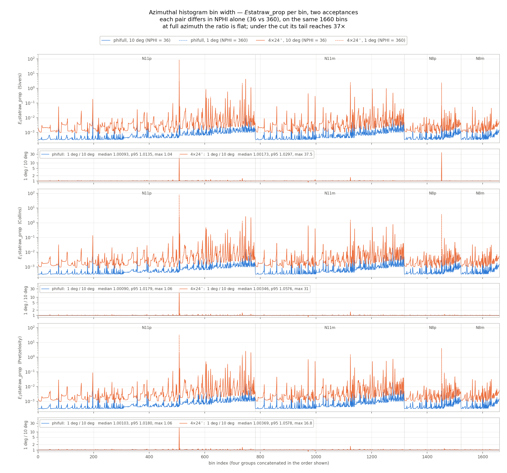
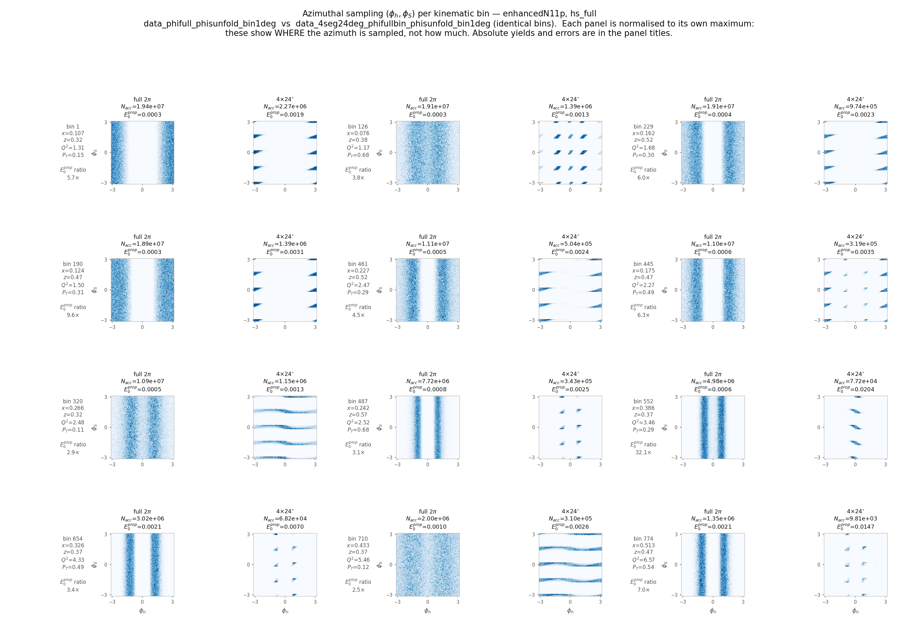
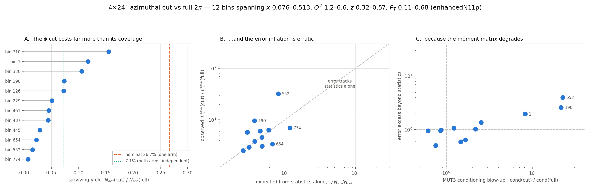

# The azimuthal cut and the $\phi_S$ folding

What an azimuthal sector cut, and the choice of folding $\phi_S$, do to the
projected statistical errors of the SoLID SIDIS ${}^3$He (neutron) pseudodata —
measured per kinematic bin over five runs of `analysis_neutron`, 2026-08-27.

## What is being measured

For each kinematic bin, `AnalyzeEstatUT3` in `SoLID_SIDIS_3He.h` fills a
two-dimensional map of the accepted event density in $(\phi_h,\phi_S)$ and
builds from it the normal matrix of the three transverse-spin modulations

$$
\mathbf f=\begin{pmatrix}\sin\phi\\ \sin(2\phi_h-\phi)\\ \sin(2\phi_h+\phi)\end{pmatrix},
\qquad \phi=\phi_h-\phi_S,
$$

whose amplitudes $(E_0,E_1,E_2)$ are the Sivers, Collins and
Pretzelosity asymmetries:

$$
G\equiv\texttt{MUT3}=\Omega\sum_k p_k\,\mathbf f_k\mathbf f_k^T,
\qquad p_k=h_k/N_\mathrm{acc}.
$$

The tree carries three estimators of the same errors, all built from that one
map so that nothing but the propagation differs:

| branch | formula | what it is |
|---|---|---|
| `E{0,1,2}statraw` | $\sqrt{\tfrac{2\pi^2}{N_\mathrm{acc}}\,\pi^2\sum_j (G^{-1}_{ij})^2}$ | **production** — the squared row norms of $G^{-1}$ |
| `E{0,1,2}statraw_diag` | $\sqrt{\tfrac{2\pi^2}{N_\mathrm{acc}}(G^{-1})_{ii}}$ | the weighted least-squares error |
| `E{0,1,2}statraw_prop` | $\big[M^{-1}\langle\mathbf u\mathbf u^T\rangle M^{-T}\big]_{ii}$, scaled | Appendix II of PR-10-006, built in the projection basis $\mathbf u$ with the mixed matrix $M=\langle\mathbf u\mathbf f^T\rangle$ |

`_prop` is deliberately built by a different matrix route than `_diag`, so their
agreement is evidence rather than a shared code path. The two are equal in exact
arithmetic; the production row norm is **not**, except when $G\propto I$ — the
flat, full-coverage limit. That is the one structural fact worth carrying into
what follows: **any departure of `Estatraw` from the other two is a measure of
how far the acceptance has pushed $G$ off-diagonal.**

Everything below is measured on `Estatraw_prop` except Result 4, which is the
production `Estatraw` weighed against it.

## The runs

Four of them are a full $2\times2$: acceptance $\times$ $\phi_S$ treatment.

| run | `phicut` | `phisfold` | azimuthal coverage |
|---|---|---|---|
| `data_phifull_phisfold_bin1deg` | 0 | `fold` | full $2\pi$ |
| `data_phifull_phisunfold_bin1deg` | 0 | `full` | full $2\pi$ |
| `data_4seg24deg_phifullbin_phisfold_bin1deg` | 4 | `fold` | 26.67% nominal |
| `data_4seg24deg_phifullbin_phisunfold_bin1deg` | 4 | `full` | 26.67% nominal |

`phicut=4` keeps four 24 deg sectors centred on $\phi=0,\pm90,180$.
`phisfold` selects the map $G$ is built from: `full` uses the signed
$\phi_S\in[-\pi,\pi]$ with $\Omega=4\pi^2$, `fold` the historical
$|\phi_S|\in[0,\pi]$ with $\Omega=2\pi^2$, which makes $G$ see
$\sin(\phi_h-|\phi_S|)$ instead of $\sin(\phi_h-\phi_S)$.

All four reuse one set of step-1 bins by symlink, so all four carry the same
**1660 bins** (782 N11p + 536 N11m + 204 N8p + 138 N8m) and pair 1:1 with each
other — 4980 amplitudes per run.

A fifth, `data_phifull_phisfold_bin10deg`, is the first row of that table run at
a coarser azimuthal histogram. It is the control for Result 5 and takes no part
in Results 1-4.

The azimuthal histograms are booked at **1 deg**: `NPHI` in
`SoLID_SIDIS_3He.h` is 360 rather than the 36 (10 deg) used before. It is a
compile-time constant, not a command-line argument, so these runs required a
rebuild and the `_bin1deg` suffix is the only record of which binary produced
them. Cost scales as $N_\phi^2$ — the cells per bin are $N_\phi^2\cdot 3/2$
— which is why the four runs together hold **6.0 GB** of `_hs.root`, 2.5 GB per
full-$2\pi$ run and 566 MB per cut run, against 43 MB for the same bins at
10 deg. They are the reason `SIDIS_MUT3_comparison/data_*/` is not in the
repository.

## Result 1 — the two constructions agree, cut or not

$\max|E^\mathrm{prop}/E^\mathrm{diag}-1|$ is $6.0\times10^{-14}$,
$1.1\times10^{-13}$, $3.0\times10^{-13}$ and $3.6\times10^{-12}$ across the
four runs — round-off between two genuinely different matrix routes. The
projection-basis construction of Appendix II and the diagonal of the inverse
normal matrix are therefore the same quantity under a cut azimuth and an
unfolded $\phi_S$ as well. The single order of magnitude of drift tracks the
cut runs' worse-conditioned $G$, not a difference in construction.

This is what licenses using `_prop` alone for the rest of the document.

## Result 2 — folding $\phi_S$ is a no-op, except where the bin is starved

$E^\mathrm{prop}(\text{unfold})/E^\mathrm{prop}(\text{fold})$, 4980 amplitudes each:

| run pair | median | p95 deviation | $>$2% off 1 | max |
|---|---|---|---|---|
| full $2\pi$ | 0.99999 | 0.34% | **0.04%** | 1.030 |
| $4\times24$ deg | 1.00038 | 0.95% | **1.95%** | 9.739 |

At full azimuth the folded and signed maps are interchangeable: two amplitudes
in 4980 move by more than 2%, the worst by 3%. That is the expected result — the
$2\pi$ event distribution is symmetric in $\pm\phi_S$, so folding discards
nothing.

Under the cut it is not symmetric: the surviving support is diagonal in
$(\phi_h,\phi_S)$, folding mixes genuinely different regions, and the tail
opens. But it stays a tail, and it is a **starvation** effect rather than a
geometric one. The three worst amplitudes are all one bin, N11p bin 508, which
retains **Nacc = 16.1** events under the cut against $4.6\times10^5$ at full
acceptance; the next worst, N8p bin 134, has Nacc = 49.4. Nothing with a
populated histogram moves.

So the historical `fold` behaviour was harmless at $2\pi$, which is where every
published projection was produced, and is harmless under a cut except in bins
whose errors are already meaningless.

Figure 1 shows the consequence: the folded and unfolded curves of a pair sit on
top of one another and cannot be told apart. Figure 4 shows why the cut is the
harder case — its surviving support is diagonal in $(\phi_h,\phi_S)$. Figure 2 is that same ratio on an
axis stretched enough to see it, where the isolated spikes are the starved bins
named above.

## Result 3 — what the $\phi$ cut costs, and how much of it is just counting

$E^\mathrm{prop}(4\times24^\circ)/E^\mathrm{prop}(2\pi)$, both folded, paired per bin:

| quantity | median | p68 | p95 | max |
|---|---|---|---|---|
| error ratio, all amplitudes | **4.13** | 5.82 | 17.0 | 3461 |
| accepted-event fraction $f=N_\mathrm{acc}(\text{cut})/N_\mathrm{acc}(2\pi)$ | 0.0706 | — | 0.159 (p95) | — |
| counting-only expectation $\sqrt{1/f}$ | 3.76 | — | 13.1 | — |
| **excess beyond counting** | **1.05** | 1.23 | 2.25 | 20.5 |

Per amplitude the cost is Sivers **3.78**, Collins **4.32**, Pretzelosity
**4.32** — Sivers is the cheapest, as in the wider $\phi$-coverage study.
11.4% of amplitudes lose more than $10\times$ and 0.86% more than
$100\times$; the extreme values belong to bins holding as few as 4.03 events.

Two things are worth separating here.

**The cut keeps 7.1% of the events, not 26.7%.** The nominal coverage
$4\times24/360$ applies to *one* azimuth. With `phiscope=all` the sectors are
required of the electron and of the hadron alike, and the median survival is
0.0706 — consistent with the two being independent, $0.267^2=0.071$. Quoting
26.7% as the event cost of this configuration is wrong by a factor of nearly 4.
Panel A of Figure 5 shows this bin by bin.

**Once that is accounted for, the lever-arm penalty at the median is only 5%.**
Removing the detector entirely — a separate $4\pi$ run on the same bins —
leaves a $1.24\times$ median excess beyond counting; cutting the azimuth of an
already-cut detector costs almost nothing beyond the events it throws away,
because the SoLID acceptance has already spent most of the azimuthal lever arm.
The tail is a different story: p95 is 2.25 and the worst bin 20.5, so the cut
does destroy the azimuthal fit in individual bins, and those are the bins the
$\chi^2$ notices. In Figure 1 this is the roughly half-decade gap between the
two full-azimuth curves and the two cut ones, holding across all four groups.

## Result 4 — the production estimator's bias roughly doubles under the cut

$E^\mathrm{raw}/E^\mathrm{prop}$, production against Appendix II:

| run | median | p95 | max | fraction $>1$ |
|---|---|---|---|---|
| phifull, fold | 1.1372 | 2.306 | 6.95 | 98.76% |
| phifull, unfold | 1.1376 | 2.310 | 6.96 | 98.78% |
| $4\times24$ deg, fold | **1.3732** | 3.833 | 41.7 | 99.70% |
| $4\times24$ deg, unfold | **1.3718** | 3.860 | 341.4 | 99.70% |

The 1.137 at full azimuth reproduces the 1.135 measured on these same bins with
a 10 deg histogram, so **the bias is insensitive to the azimuthal bin width** —
as it must be, since it is a property of $G$, not of how $G$ is sampled.
Cutting the azimuth then drives it from 13% to 37% at the median, and from
$6.9\times$ to $41\times$ in the worst bin.

That is the expected direction: the row norm equals the diagonal only for
$G\propto I$, and cutting the azimuth is precisely what makes $G$
off-diagonal. Its consequence is one-directional — **projected errors too large,
and every improvement factor built from them understated** — and it is worst
exactly in the cut configurations the $\phi$-coverage study compares.

## Result 5 — the histogram bin width: nothing at full azimuth, everything in a starved cut bin

Every 1 deg run above books its azimuthal map at `NPHI = 360`. What that
granularity buys is measurable by rebuilding at `NPHI = 36` — a **10 deg**
histogram — and changing nothing else. Two pairs, one per acceptance:

| pair | 10 deg run | 1 deg run |
|---|---|---|
| full $2\pi$, $\phi_S$ folded | `data_phifull_phisfold_bin10deg` | `data_phifull_phisfold_bin1deg` |
| $4\times24^\circ$, $\phi_S$ signed | `data_4seg24deg_phifullbin_phisunfold_bin10deg` | `data_4seg24deg_phifullbin_phisunfold_bin1deg` |

The control is exact in both: `Nacc` and `fn` are **bitwise identical** across
each pair, all 1660 bins. The generator is deterministic, so nothing whatever
differs except the granularity of the map that $G$ is built from.

$E^\mathrm{prop}$(1 deg)$/E^\mathrm{prop}$(10 deg):

| | median | p68 | p95 | p99 | max | min | $>$1 | $>$1% |
|---|---|---|---|---|---|---|---|---|
| full $2\pi$ | 1.00096 | 1.00304 | 1.01572 | 1.02960 | 1.0580 | 0.9937 | 88.0% | 13.3% |
| $4\times24^\circ$ | 1.00287 | 1.00750 | 1.05378 | 1.10859 | **37.50** | 0.8119 | 84.2% | **26.8%** |

**At full azimuth, refining the histogram raises the error slightly and almost
always** — 88% of amplitudes, floor at 0.9937. A coarse histogram averages the
acceptance over each 10 deg cell, which flattens the structure $G$ is built to
see and makes it look better conditioned than it is. So 10 deg
**underestimates**, in the direction the argument predicts, by 0.1% at the median
and 1.6% at p95.

**Under the cut the median barely moves but the tail explodes.** 0.3% at the
median against 0.1%, but p99 goes from 3% to 11%, more than a quarter of
amplitudes move by over 1%, and the worst reaches $\mathbf{37.5\times}$. The bins
responsible are the starved ones already named in Result 2: N8p bin 134
(`Nacc` = 49.4) at $37.5\times$ and N11p bin 508 (`Nacc` = 16.1) at
$17\text{-}31\times$. Where a bin holds tens of events spread over a diagonal support,
whether the histogram resolves that support at all decides the answer.

**Two amplitudes have no answer at 10 deg.** N8p bin 134, $i = 1, 2$: the
inverted `MUT3` has a non-positive diagonal, the run prints
`non-positive diagonal in inverted MUT3!`, and `Estatraw_diag` and
`Estatraw_prop` come out `nan` — correctly, since $G$ is numerically singular
there. At 1 deg the same bin produces no warning at all. **This is the only
configuration in the study that has produced the warning**, which is worth
holding onto: it takes a cut azimuth *and* a coarse histogram *and* a starved bin
together.

Figure 3 is both pairs per bin: two curves that cannot be told apart at full
azimuth, and ratio panels flat on unity except for the two spikes.

The practical reading has to be split. **At full azimuth 10 deg is adequate** —
1 deg costs $100\times$ the histogram cells and $58\times$ the disk (2.5 GB
against 43 MB) to move a projected error by a tenth of a percent. **Under a cut
it is not**, not because the median moves but because the bins that decide a
$\chi^2$ are exactly the ones where it does.

## Result 6 — the same effects seen bin by bin, and where they come from

Results 2-5 are ensemble statements over 4980 amplitudes. Twelve bins of
`enhancedN11p`, chosen to span $x$ 0.076-0.513, $Q^2$ 1.2-6.6, $z$ 0.32-0.57 and
$P_T$ 0.11-0.68, carry the same story one bin at a time, for the unfolded pair
`data_phifull_phisunfold_bin1deg` against
`data_4seg24deg_phifullbin_phisunfold_bin1deg`. Figures 4 and 5.

**The cut support is diagonal in $(\phi_h,\phi_S)$.** Figure 4 is the geometric
statement behind Result 2. At full azimuth each bin fills two broad $\phi_h$
bands across all $\phi_S$; under the cut what survives is a lattice of diagonal
slivers, because the sector condition is on the lab azimuths while the histogram
axes are $\phi_h$ and $\phi_S$. Folding $|\phi_S|$ onto a diagonal support maps
different regions onto each other — which is why folding is exactly harmless at
$2\pi$ and only nearly harmless under a cut.

**The yield, per bin.** Panel A of Figure 5: the surviving fraction runs from
0.007 to 0.155 with a median of **0.048**. Nine of the twelve sit below the 7.1%
both-arms line, none within a factor of two of the nominal 26.7%. Result 3's
correction is not an average that hides compliant bins; it is every bin.

**The conditioning is the mechanism.** Panel C plots the error excess beyond
counting against the blow-up of the `MUT3` condition number,
$\mathrm{cond}(G_\mathrm{cut})/\mathrm{cond}(G_\mathrm{full})$, computed from
the same maps at full 1 deg resolution. The two bins whose matrix degrades most —
552 at $22\times$ and 190 at $21\times$ — are the two with the largest excess,
4.0 and 2.6. Bins whose conditioning is unchanged sit on 1. The azimuthal lever
arm is not a metaphor: it is the conditioning of $G$, and it is measurable per
bin.

**A caution the ensemble numbers hide.** These per-bin ratios depend on which
estimator is quoted, far more than the medians do:

| bin | yield | inflation, $E^\mathrm{prop}$ | inflation, $E^\mathrm{raw}$ |
|---|---|---|---|
| 552 | 0.0155 | 32.1 | **162.8** |
| 190 | 0.0734 | 9.6 | **32.0** |
| 1 | 0.1171 | 5.7 | **13.8** |
| 487 | 0.0444 | 3.1 | **1.6** |
| 774 | 0.0073 | 7.0 | **3.5** |
| median of the twelve | 0.048 | **5.13** | **4.13** |

The production row norm moves individual bins by up to $5\times$ **in either
direction** — up where the cut degrades $G$ (Result 4: `raw/prop` reaches 5.1 in
bin 552's cut run), down where the *uncut* run is the badly conditioned one
(bin 487, `raw/prop` 2.12 at full against 1.09 under the cut). The median
inflation barely moves, and the median excess beyond counting is 1.01 either way.
So the ensemble conclusions of Results 3 and 4 are estimator-independent, while
**any statement about a named bin is not** — quote the estimator with it.

## Result 7 — the earlier 12-bin study, merged from the phi-cut study

Moved here 2026-08-31. It is the same investigation as Result 6, done first: the
same 12 `enhancedN11p` bins, the same cond-versus-excess argument, measured
2026-08-26 on `data_phifull_phisfold_bin10deg` against
`data_phi4seg24deg_phifullbin` -- the 10 deg folded runs, before the 1 deg
unfolded ones existed. It lived in the repo-root `phicompare.md` until that document was reduced to its
standing conclusions and then folded into `phicompare/README.md`.

**Read the ratios below as row-norm values.** They were computed from `E0stat`,
i.e. from the production `Estatraw`, which Result 4 shows overstates the cut runs
by ~37% at the median and by up to 41x in the tail. Bin 552 reads 157x here and
32x with `Estatraw_prop` (Result 6's table). The *pattern* -- which bins inflate,
and that conditioning is what separates them -- survives the estimator change;
the individual numbers do not.

Results 3 and 6 supersede its §1 and §3 with all-4980-amplitude measurements.
What only exists here is the per-bin detail: the yield/error/conditioning table,
the φ_h-coverage counts, and the two-bin contrast that makes the mechanism
concrete.

### Where the azimuthal penalty comes from — the 2026-08-26 measurement

**Measured 2026-08-26** on `data_phifull_phisfold_bin10deg` (this directory) vs `phicompare/data_phi4seg24deg_phifullbin`
(4 sectors × 24° = 26.7% nominal coverage, `phiscope=all`), `enhancedN11p`,
12 bins spanning *x* 0.076–0.513, Q² 1.2–6.6, *z* 0.32–0.57, P_T 0.11–0.68.
The two runs share a bin list by symlink, so bin *i* is the same kinematic cell
in each.

Figures: the `gallary_phicompare/` originals were deleted 2026-08-31. Their
successors, rebuilt from the 1 deg unfolded runs, are Figures 4 and 5 above —
`hs-phifull-vs-4seg24deg-phisunfold-bin1deg` and
`hs-summary-phicut-cost-phisunfold-bin1deg` in this directory.

#### 1. The cut costs far more than its nominal coverage

Surviving yield `Nacc(cut)/Nacc(full)` has a **median of 4.8%**, range
0.7%–15.5% — against a nominal single-arm coverage of 26.7%.

The φ cut applies to the electron *and* the hadron, so a SIDIS coincidence
survives roughly the product: 26.7²% ≈ 7.1% if the two lab azimuths were
independent. Every bin measured sits at or below that line, so **the coincidence
requirement, not the nominal coverage, sets the cost.** Treating a `phicut` run
as a luminosity factor of `phicut × phiwidth / 360` is wrong by roughly a factor
of five.

#### 2. The error inflation is erratic, not a √N penalty

`E0stat(cut)/E0stat(full)` spans **1.6× to 157×**, against pure-counting
expectations `√(N_full/N_cut)` of 2.5×–11.7×. Points fall on *both* sides of the
counting line: bin 552 is 20× worse than counting predicts, while bins 487 and
654 come in *below* it.

| bin | x | P_T | yield ratio | E₀ ratio | counting-only | cond(MUT3) full → cut |
|---|---|---|---|---|---|---|
| 710 | 0.433 | 0.12 | 0.155 | 2.5 | 2.5 | 1.4 → 1.2 |
| 1 | 0.107 | 0.15 | 0.117 | 13.6 | 2.9 | 1.8 → 14.5 |
| 320 | 0.266 | 0.11 | 0.106 | 2.7 | 3.1 | 2.0 → 1.2 |
| 190 | 0.124 | 0.31 | 0.073 | 30.9 | 3.7 | 1.2 → 24.4 |
| 126 | 0.076 | 0.68 | 0.073 | 4.0 | 3.7 | 1.5 → 3.1 |
| 229 | 0.162 | 0.30 | 0.051 | 9.1 | 4.4 | 3.0 → 7.5 |
| 461 | 0.227 | 0.29 | 0.045 | 4.3 | 4.7 | 3.9 → 3.4 |
| 487 | 0.242 | 0.68 | 0.044 | 1.6 | 4.8 | 7.7 → 11.6 |
| 445 | 0.175 | 0.49 | 0.029 | 6.9 | 5.9 | 4.5 → 5.6 |
| 654 | 0.326 | 0.49 | 0.023 | 2.1 | 6.7 | 23.0 → 15.4 |
| 552 | 0.386 | 0.29 | 0.016 | **157** | 8.0 | 2.8 → **60.8** |
| 774 | 0.513 | 0.54 | 0.007 | 3.2 | 11.7 | 9.4 → 11.9 |

#### 3. The cause is MUT3 conditioning, now measured directly

`phicompare_old.md` argued this from the outside — the error carries the
conditioning of the 3×3 azimuthal moment matrix, so narrow the acceptance and
the three modulations stop being separable. **That is now measured rather than
inferred.** Every bin whose error exceeds counting is a bin whose MUT3 condition
number blows up, and every bin with cond ratio ≈ 1 sits at excess ≈ 1.

What the surviving support looks like, measured rather than eyeballed. **φ_S
coverage is identical in every bin** — 16 of 36 rows populated, set by the four
sectors — so the discriminator is not "how much φ_S survives". What varies is the
φ_h extent and how concentrated the support is:

| bin | φ_h bins populated | effective cells | cond blow-up | error excess |
|---|---|---|---|---|
| 320 | 36 | 353 | 0.6× | 0.9 |
| 710 | 36 | 357 | 0.9× | 1.0 |
| 461 | 36 | 154 | 0.9× | 0.9 |
| 190 | 16 | 87 | 20.5× | 8.4 |
| 552 | 23 | 64 | 21.7× | 19.6 |
| 654 | 14 | 60 | 0.7× | 0.3 |

("effective cells" = participation ratio exp(−Σp ln p) over the map.)

**Full φ_h coverage is sufficient for the error to track counting** — every bin
with 36/36 populated φ_h columns sits at excess ≈ 0.9–1.0. But losing φ_h
coverage is *not* sufficient to inflate it: bin 654 keeps only 14 φ_h columns and
60 effective cells, yet comes in *below* counting. **The conditioning of MUT3 is
the operative quantity and is not reducible to any single coverage count** —
which is the point of panel C, and why the maps alone cannot be read off by eye.

Bins 552 and 461 make it concrete: near-identical kinematics (P_T ≈ 0.29 both),
comparable yield loss, but 157× versus 4.3× error inflation — purely from *where*
the surviving azimuth sits. Bin 552 is the extreme, cond 2.8 → 60.8 with
E₀ = **0.999**: it constrains the amplitude essentially not at all while still
holding 7.7e4 accepted events.

**A correction worth recording.** An earlier reading of these maps described bins
320/710/774 as "horizontal stripes with φ_h fully sampled, only φ_S sectored".
That is wrong — under (φ_h, φ_S) → (−φ_h, φ_S) those bins are asymmetric at
0.46–0.55, i.e. as asymmetric as any other. **Every** cut bin has diagonal
support (see `check.md`, 2026-08-26); the visual difference is φ_h *extent*, not
a difference in which angle got sectored.

**Consequence for planning.** More beam time does not fix a bin in the
near-singular regime. Where the sectors are placed matters as much as how much
azimuth they cover, and the two effects are separable only bin by bin.

#### How that measurement was done

`AnalyzeEstatUT3` now saves every bin's azimuthal maps (`code.md`, step 1-3), so
the error analysis can be redone offline without re-running step 2. Recomputing
`Estat` in Python from the saved folded `hs` — same 2π² normalisation, same
`j <= 18` bound, same `/fn/0.6/0.86` — reproduces the C++ tree values to
**4.9e-9** across all 24 cases (12 bins × 2 runs) and all three amplitudes, which
is float32 storage precision. The condition numbers above come from that same
reconstruction.

Note that `hs` is folded onto |φ_S|, so MUT3 evaluates `sin(φ_h − |φ_S|)` rather
than `sin(φ_h − φ_S)`. `hs_full` keeps the unfolded distribution and is what the
map figure shows. **That folding has been checked and is safe** — it changes
`Estat` by ≤2% in 90% of bins and by >2× in exactly one bin of 782 (`Nacc = 16`,
meaningless either way). `phifull` is ±φ_S symmetric to the noise floor; the
φ-cut runs are *not* — their surviving support is diagonal in (φ_h, φ_S), so
they keep only the flip-both symmetry — but the error cancels regardless.
Evidence and reproduction in `check.md`, 2026-08-26.

This also confirms the near-singular bins are not a folding artifact: of the 46
cut-run bins with E₀ > 0.5, folding accounts for one. Bin 552 is 0.9991 folded
vs 0.9830 unfolded.

#### Caveat on scope

**12 bins of 1660, chosen to span the kinematics — not a census.** The
association in panel C is clear across them, but four points carry the
high-excess end. Extending to all 1660 bins would turn that into a distribution
and answer the question this raises: **what fraction of a `_phifullbin` dataset
sits in the near-singular regime**, and therefore how much of the quoted φ-cut
penalty is degraded bins rather than lost statistics. Not yet done.

---

---

## Figures

An amplitude per main panel with a ratio panel beneath it; the horizontal axis
is the four groups concatenated in the order N11p, N11m, N8p, N8m, each a
separate tree with its own bin index. A vector `.pdf` sits beside each `.png`.

**Figure 1 — `Estatraw_prop` per bin for all four runs.** The two full-azimuth
curves lie on top of one another and the two cut curves lie on top of one
another, which is Result 2 rendered as a picture: the pairs differ only in the
$\phi_S$ treatment and are indistinguishable. The half-decade gap between the
pairs is Result 3. In the ratio panels the fold/unfold trace is pinned to unity
while the cut/uncut trace floats at ~4 with excursions past $10^2$.

**Figure 2 — the $\phi_S$ unfold/fold ratio alone, on a zoomed axis.** The
trace hidden at unity in Figure 1. Full azimuth (blue) is flat to a few parts in
$10^3$; the cut (orange) is flat too, punctuated by isolated spikes. Those
spikes are the starved bins of Result 2 — the axis is clipped at 1.6, so N11p
bin 508's $9.7\times$ runs off the top of all three panels.

**Figure 3 — two acceptances at two histogram bin widths.** Each pair differs in
`NPHI` alone. The main panels are uninformative on purpose: at this scale a
$100\times$ change in the histogram is invisible, which is the result — the blue
pair (full $2\pi$) and the orange pair (cut) each lie on top of themselves, half
a decade apart from each other. The ratio panels hold the entire effect: flat on
unity for both acceptances, except for the two starved-bin spikes in orange that
reach $37\times$.

**Figure 4 — where the azimuth is sampled, 12 bins, uncut against cut.**
`hs_full` for each pair, every panel normalised to its own maximum, so these show
*where* the azimuth is sampled and not how much; absolute $N_\mathrm{acc}$ and
$E_0^\mathrm{prop}$ are in the panel titles. The 1 deg maps are rebinned to
4 deg for display only — the matrices behind Figure 5 use the full resolution.
The diagonal slivers in every cut panel are the support that makes folding
$\phi_S$ non-trivial.

**Figure 5 — what the cut costs, and why.** A: the surviving yield against the
nominal one-arm coverage (26.7%) and the both-arms expectation (7.1%). B: the
observed $E_0^\mathrm{prop}$ inflation against $\sqrt{N_\mathrm{full}/N_\mathrm{cut}}$,
the counting-only prediction; points on the dashed line pay only for the events
lost. C: the excess beyond counting against the conditioning blow-up of `MUT3` —
the correlation that names the mechanism.

## Verdict

**The $\phi_S$ folding is not a source of error.** At full azimuth the folded
and signed maps agree to a few parts in $10^3$; under a cut they part company
only in bins holding tens of events, whose errors are already meaningless. The
historical `fold` behaviour can be reproduced or abandoned without moving any
published number.

**The production estimator's bias is worst exactly where the $\phi$-coverage
study lives.** It does not care about the azimuthal bin width — 1.137 at 1 deg
against 1.135 at 10 deg — but cutting the azimuth drives it from 13% to 37% at
the median and to $41\times$ in the worst bin. Every improvement factor quoted
for a cut configuration is built on errors overstated by more than a third at the
median, so switching production from `Estatraw` to `Estatraw_diag` matters more
for the cut runs than for the $2\pi$ baseline.

**The azimuthal histogram bin width is not a live variable at full azimuth, and
is one under a cut.** At $2\pi$, going from 10 deg to 1 deg raises
$E^\mathrm{prop}$ by 0.1% at the median and 1.6% at p95, for $100\times$ the
histogram cells and $58\times$ the disk — run at 10 deg. Under the cut the median
is still 0.3%, but p99 is 11% and the worst bin moves by $37\times$, and one bin
of 1660 has no answer at 10 deg at all because its `MUT3` is singular there. A
sector run wants the finer histogram, or at least a check that the bins it
depends on are not the starved ones.

**The azimuthal lever arm is the conditioning of $G$.** Bin by bin, the error
excess beyond counting tracks how much worse `MUT3` is conditioned under the cut:
the two bins of twelve whose condition number blows up by $>20\times$ are the two
with the largest excess. This is the mechanism behind every "lever arm" statement
above, and it is measurable per bin rather than inferred.

A third result is a measurement rather than a defect: the `4 x 24 deg`
configuration keeps **7.1% of accepted events, not the nominal 26.7%**, because
`phiscope=all` demands the sectors of the electron and the hadron alike. Priced
against that, its error inflation is almost entirely counting statistics —
$1.05\times$ excess at the median, though $20.5\times$ in the worst bin.
